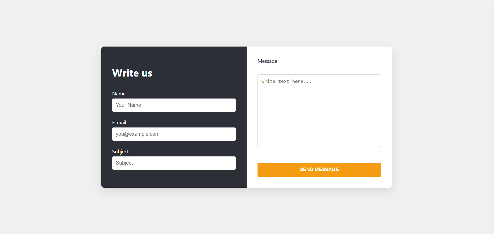

# Contact Us Page with Form Validation

This project is a modern, responsive **"Contact Us"** page built using **HTML, CSS, and JavaScript**. The layout is inspired by a clean, two-column design with a dark and light theme, featuring real-time form validation and a thank-you popup on successful submission.

## Features

- Two-column split layout (Dark Left / Light Right)
- Input fields: Name, Email, Subject, Message
- JavaScript validation:
  - All fields are required
  - Email format is checked with regex
- HTML5 validation using `required` and `type="email"`
- Thank-you message appears after successful submission
- Form auto-clears on submit
- Responsive design for mobile and tablets

## Tech Stack

- HTML5
- CSS3 
- JavaScript 

## Page

- The final result looks like 

## 📁 Folder Structure
- `index.html` – main structure
- `style.css` – layout and design
- `script.js` – app logic
- `ss.png` – final result
- `README.md` – this file

